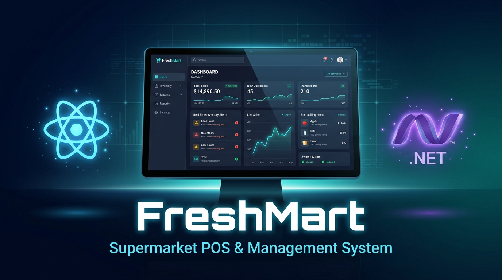

<div align="center">
  <br />
  
  <br />

  <div>
    
    
    
    
    
    
    
    
    
  </div>

  <h3 align="center">FreshMart — Supermarket POS &amp; Realtime Management System</h3>

  <div align="center">
    A full-stack, enterprise-ready supermarket management platform with an ultra-fast POS interface,<br/>
    real-time SignalR WebSockets dashboard, inventory tracking, employee &amp; shift management, and customer loyalty programs.
  </div>
</div>

---

## 📋 Table of Contents

1. ✨ [Introduction](#introduction)
2. ⚙️ [Tech Stack](#tech-stack)
3. 🔋 [Features](#features)
4. 🗂️ [Project Structure](#project-structure)
5. 🤸 [Quick Start](#quick-start)
6. 🌐 [API & WebSocket Hub Overview](#api-overview)
7. 📌 [Environment Variables](#environment-variables)
8. 📝 [Development Notes & Architecture](#development-notes)

---

## <a name="introduction">✨ Introduction</a>

**FreshMart** is a comprehensive supermarket management system built on a modern **full-stack & real-time** architecture:

- **Backend**: ASP.NET Core 10 Web API with JWT authentication, Entity Framework Core 10, PostgreSQL, and **SignalR WebSockets Hub**.
- **Frontend**: React 19 + TypeScript 5.8 + Vite 6 + Tailwind CSS v4 — a responsive POS & Dashboard interface with zero-latency live updates and modular Clean Code architecture.

The system covers all core operations of a real-world supermarket: in-store POS sales, automated inventory tracking, supplier purchase orders, employee & shift management, VIP customer loyalty points, and real-time interactive business analytics.

---

## <a name="tech-stack">⚙️ Tech Stack</a>

### Backend

| Technology | Purpose |
|---|---|
| **[ASP.NET Core 10](https://dotnet.microsoft.com/)** | High-performance Web API framework |
| **[ASP.NET Core SignalR](https://learn.microsoft.com/aspnet/core/signalr/introduction)** | Realtime bidirectional WebSocket communication for instant dashboard synchronization |
| **[Entity Framework Core 10](https://learn.microsoft.com/ef/core/)** | Code-First / Db-First ORM with auto-migrations and type-safe LINQ queries |
| **[Npgsql EF Core Provider](https://www.npgsql.org/efcore/)** | High-performance PostgreSQL driver for EF Core |
| **[EFCore.NamingConventions](https://github.com/efcore/EFCore.NamingConventions)** | Auto-maps `PascalCase` C# models to `snake_case` PostgreSQL columns |
| **[JWT Bearer + Query Token](https://learn.microsoft.com/aspnet/core/security/authentication/jwt-authn)** | Token-based authentication for HTTP requests and WebSocket handshakes |
| **[BCrypt.Net-Next](https://github.com/BcryptNet/bcrypt.net)** | Secure password and cashier PIN hashing |
| **[Scalar](https://scalar.com/)** | Next-generation interactive API documentation |
| **[PostgreSQL](https://www.postgresql.org/)** | Primary relational database with ACID guarantees and JSON/UUID support |

### Frontend

| Technology | Purpose |
|---|---|
| **[React 19](https://react.dev/)** | Modern UI framework with concurrent features and server actions |
| **[@microsoft/signalr](https://www.npmjs.com/package/@microsoft/signalr)** | Official Microsoft SignalR client with automatic reconnect & binary WebSocket fallback |
| **[TypeScript 5.8](https://www.typescriptlang.org/)** | Strict static typing across components, hooks, and services |
| **[Vite 6](https://vitejs.dev/)** | Lightning-fast build tool with Instant HMR |
| **[Tailwind CSS v4](https://tailwindcss.com/)** | High-performance utility-first styling via `@tailwindcss/vite` |
| **[React Router v7](https://reactrouter.com/)** | Declarative client-side routing |
| **[Zustand](https://zustand-demo.pmnd.rs/)** | Lightweight global reactive state stores |
| **[Axios](https://axios-http.com/)** | HTTP client with request/response JWT interceptors |
| **[Recharts](https://recharts.org/)** | Interactive data visualization (Bar, Donut, Bi-directional charts) |
| **[Lucide React](https://lucide.dev/)** | Clean, modern SVG icon system |
| **[Motion](https://motion.dev/)** | Fluid micro-interactions and animations |

---

## <a name="features">🔋 Features</a>

📊 **Real-time SignalR Dashboard (`/dashboard`)**
Live KPI counters (Sales, Purchases, Returns, Gross Profit, Net Margin), dynamic time-filtered Recharts graphs (`1D`, `1W`, `1M`, `3M`, `6M`, `1Y`), low-stock alerts with quick restock, and auto-updating recent transactions without page reload.

🛒 **Point of Sale (POS) Interface (`/pos`)**
Full in-store checkout system with live product catalog from database, barcode scanning, shopping cart, held/parked orders, and multi-method payment processing (Cash, VietQR, POS Card, Loyalty points).

📦 **Product & Category Management (`/products`, `/categories`)**
Full CRUD for products with SKU, barcode, unit, cost/sell prices, stock levels, minimum stock thresholds, supplier association, and dynamic category filters.

🏭 **Purchase Orders & Stock Replenishment (`/purchases`)**
Manage supplier purchase orders with statuses (`Pending` → `Received` → `Cancelled`). Automatic inventory balance and cost price synchronization upon receiving goods.

📊 **Inventory Management & Audits (`/inventory`)**
Real-time stock level monitoring, low-stock warnings, and manual inventory adjustments with audit reasons (`Damage`, `Expiry`, `Count`, `Return`).

👥 **Employee & Shift Management (`/employees`, `/shifts`)**
Manage employee accounts, assign roles (`Cashier`, `Store Manager`, `Warehouse Staff`), and set 4-digit POS PINs. Open/close work shifts with opening cash verification, actual cash drawer reconciliations, and detailed financial shift reports.

👤 **Customer Management & VIP Loyalty (`/customers`)**
Register customers, automatically accrue loyalty points per transaction, and calculate membership tiers (`Kim Cương`, `Vàng`, `Bạc`, `Thân thiết`).

🔔 **In-App Notifications (`/notifications`)**
Realtime system alerts for low stock levels, shift closings, and goods receipt.

---

## <a name="project-structure">🗂️ Project Structure</a>

```
dotnet-backend-freshmart/          # Solution root
│
├── 📁 Hubs/                       # Realtime SignalR WebSockets Hubs
│   ├── IDashboardHubClient.cs     # Strongly-typed client broadcast interface
│   └── DashboardHub.cs            # Hub endpoint (/hubs/dashboard)
│
├── 📁 Controllers/                # REST API controllers
│   ├── AuthController.cs          # POST /api/v1/auth/login, /register, /login-pin
│   ├── DashboardController.cs     # GET /api/v1/dashboard/full, /kpi-summary...
│   ├── ProductsController.cs      # CRUD /api/v1/products
│   ├── CategoriesController.cs    # CRUD /api/v1/categories
│   ├── OrdersController.cs        # POST /api/v1/orders/checkout, order history
│   ├── PosController.cs           # Barcode lookup, held orders
│   ├── InventoryController.cs     # Stock tracking & adjustments
│   ├── PurchaseOrdersController.cs # Supplier purchase orders
│   ├── EmployeesController.cs     # Employee management & PIN reset
│   ├── CustomersController.cs     # Customer registration & loyalty tiers
│   ├── ShiftsController.cs        # Shift open / close / report
│   ├── SuppliersController.cs     # Supplier CRUD
│   ├── ReportsController.cs       # Revenue & profit reports
│   └── NotificationsController.cs # System notifications
│
├── 📁 Models/                     # EF Core entity models
│   ├── Product.cs
│   ├── Category.cs
│   ├── Order.cs / OrderItem.cs
│   ├── PurchaseOrder.cs / PurchaseOrderItem.cs
│   ├── Employee.cs
│   ├── Customer.cs
│   ├── Shift.cs
│   ├── Supplier.cs
│   ├── InventoryAdjustment.cs
│   ├── Notification.cs
│   └── Enums/                     # PaymentMethod, OrderStatus, ShiftStatus, LoyaltyTier...
│
├── 📁 Services/                   # Business logic layer
│   ├── AuthService.cs             # JWT + BCrypt authentication
│   ├── JwtTokenService.cs         # Token generation & validation
│   ├── DashboardService/          # Realtime KPI calculations & broadcast
│   ├── ProductService/
│   ├── OrderService/              # Checkout logic + VIP points trigger
│   ├── PurchaseOrderService/      # Receiving goods + inventory sync trigger
│   ├── ShiftService/
│   ├── CustomerService/           # Points accrual & tier management
│   ├── ReportService/
│   └── ...
│
├── 📁 DTOs/                       # Request / response data transfer objects
│   ├── Dashboard/                 # FullDashboardResponse, DashboardKpiResponse...
│   ├── Auth/                      # Login, Register, Token responses
│   └── ...
│
├── 📁 Config/                     # ServiceConfig — DI, SignalR, CORS, JWT, DB
├── 📁 Data/                       # AppDbContext (EF Core configurations)
├── 📁 Migrations/                 # EF Core database migrations
├── 📁 Middleware/                 # ExceptionHandlingMiddleware (global error handler)
├── 📁 docs/                       # API design docs & coding conventions
│   ├── API_DEVELOPMENT_PLAN.md
│   └── api_convention.txt
│
├── seed_dashboard_data.sql        # Rich seed SQL dataset for PostgreSQL
├── appsettings.json               # Runtime config (gitignored)
├── appsettings.example.json       # Config template
├── Program.cs                     # App bootstrap & middleware pipeline
│
└── 📁 freshmart/                  # React Frontend (Vite)
    ├── 📁 src/
    │   ├── 📁 components/         # Clean modular UI components
    │   │   ├── 📁 dashboard/      # 13 Modular Dashboard Subcomponents
    │   │   │   ├── DashboardHeader.tsx
    │   │   │   ├── DashboardHeroCards.tsx
    │   │   │   ├── DashboardDetailCards.tsx
    │   │   │   ├── SalesPurchaseChart.tsx
    │   │   │   ├── OverallInfoSection.tsx
    │   │   │   ├── TopSellingList.tsx
    │   │   │   ├── LowStockAlertCard.tsx
    │   │   │   ├── RecentSalesCard.tsx
    │   │   │   ├── SalesStatisticsChart.tsx
    │   │   │   ├── RecentTransactionsTable.tsx
    │   │   │   ├── TopCustomersList.tsx
    │   │   │   ├── CategoryPieSection.tsx
    │   │   │   ├── OrderHeatmapSection.tsx
    │   │   │   └── index.ts
    │   │   ├── 📁 pos/            # POS catalog, cart panel, category rail
    │   │   ├── 📁 categories/     # Category CRUD modals & table
    │   │   ├── 📁 customers/      # Customer modals & details
    │   │   ├── 📁 employees/      # Employee & PIN reset modals
    │   │   ├── 📁 inventory/      # Stock adjust & audit modals
    │   │   ├── 📁 purchases/      # Purchase detail modals
    │   │   ├── 📁 shifts/         # Open/Close shift modals & reports
    │   │   ├── 📁 suppliers/      # Supplier modals & table
    │   │   ├── DashboardView.tsx   # Dashboard assembly view
    │   │   ├── POSView.tsx         # Main POS view
    │   │   └── ...
    │   ├── 📁 pages/              # Route-level page components
    │   │   ├── Dashboard/DashboardPage.tsx
    │   │   ├── POS/POSPage.tsx
    │   │   └── ...
    │   ├── 📁 services/           # Axios & SignalR service layer
    │   │   ├── signalr.service.ts  # WebSocket SignalR Hub client
    │   │   ├── dashboard.service.ts
    │   │   ├── apiClient.ts
    │   │   └── ...
    │   ├── 📁 stores/             # Zustand global state stores (dashboardStore, etc.)
    │   ├── 📁 types/              # TypeScript interfaces & DTO definitions
    │   └── 📁 utils/              # Formatting & helper utilities
    ├── package.json
    └── vite.config.ts
```

---

## <a name="quick-start">🤸 Quick Start</a>

### Prerequisites

Make sure you have the following installed:

- **[.NET 10 SDK](https://dotnet.microsoft.com/download)** — Backend runtime & tooling
- **[Node.js](https://nodejs.org/)** v18 or higher — For the frontend
- **[npm](https://www.npmjs.com/)** or **[Yarn](https://yarnpkg.com/)**
- **[PostgreSQL](https://www.postgresql.org/)** — Running locally or via a cloud provider (Neon, Supabase, Railway)
- **EF Core CLI**: `dotnet tool install --global dotnet-ef`

---

### Backend Setup

**1. Clone the repository**

```bash
git clone https://github.com/your-username/dotnet-backend-freshmart.git
cd dotnet-backend-freshmart
```

**2. Configure app settings**

```bash
cp appsettings.example.json appsettings.json
```

Fill in your real values (see [Environment Variables](#environment-variables) below).

**3. Apply database migrations & seed data**

```bash
dotnet ef database update
psql -U postgres -d freshmart_db -f seed_dashboard_data.sql
```

**4. Start the development server**

```bash
dotnet run
```

The API will be available at **`http://localhost:5211`**.  
Interactive API documentation (Scalar) is available at **`http://localhost:5211/scalar`** in Development mode.

---

### Frontend Setup

```bash
cd freshmart
npm install
npm run dev
```

The frontend will be available at **`http://localhost:3000`**.

---

### Useful Scripts

#### Backend (dotnet CLI)

| Command | Description |
|---|---|
| `dotnet run` | Start the backend server on port 5211 |
| `dotnet watch run` | Start with hot-reload |
| `dotnet build` | Compile the project |
| `dotnet ef database update` | Apply pending EF migrations |
| `dotnet ef migrations add <Name>` | Create a new EF migration |

#### Frontend (npm)

| Command | Description |
|---|---|
| `npm run dev` | Start Vite dev server on port 3000 |
| `npm run build` | Build the production bundle with type checking |
| `npm run preview` | Preview the production build |
| `npm run lint` | Run TypeScript type validation |

---

## <a name="api-overview">🌐 API & WebSocket Hub Overview</a>

> **Base URL**: `http://localhost:5211/api/v1`  
> **SignalR Hub**: `http://localhost:5211/hubs/dashboard`  
> All secured endpoints require the header: `Authorization: Bearer <token>`

### ⚡ SignalR WebSocket Hub (`/hubs/dashboard`)

| Client Event | Direction | Payload | Description |
|---|---|---|---|
| `ReceiveDashboardUpdate` | Server ➔ Client | `FullDashboardResponse` | Full KPI and chart state update |
| `ReceiveKpiUpdate` | Server ➔ Client | `DashboardKpiResponse` | Realtime hero counters update |
| `ReceiveRecentTransaction`| Server ➔ Client | `RecentTransactionResponse`| Broadcast new POS order |
| `ReceiveLowStockAlert` | Server ➔ Client | `LowStockProductResponse[]`| Live low-stock notifications |

### 📊 Dashboard REST Endpoints

| Method | Endpoint | Auth | Description |
|---|---|---|---|
| `GET` | `/dashboard/full` | JWT | Get full consolidated dashboard dataset |
| `GET` | `/dashboard/kpi-summary` | JWT | Get 15+ high-level KPI metrics |
| `GET` | `/dashboard/sales-purchase-chart` | JWT | Get sales & purchases over timeframe (`1D`, `1W`, `1M`, `3M`, `6M`, `1Y`) |
| `GET` | `/dashboard/category-sales-pie` | JWT | Get category distribution breakdown |
| `GET` | `/dashboard/recent-transactions` | JWT | Get latest transaction stream |
| `GET` | `/dashboard/low-stock-alert` | JWT | Get inventory items under minimum threshold |

### 🔐 Authentication

| Method | Endpoint | Auth | Description |
|---|---|---|---|
| `POST` | `/auth/register` | Public | Register a new user |
| `POST` | `/auth/login` | Public | Login with username & password |
| `POST` | `/auth/login-pin` | Public | POS login with 4-digit PIN |
| `GET` | `/auth/me` | JWT | Get current user profile |

### 📦 Products & Categories

| Method | Endpoint | Auth | Description |
|---|---|---|---|
| `GET` | `/products` | JWT | List products (paginated, searchable) |
| `GET` | `/products/:id` | JWT | Get product details |
| `GET` | `/products/barcode/:code` | JWT | Barcode lookup for POS |
| `POST` | `/products` | Manager | Create a new product |
| `PUT` | `/products/:id` | Manager | Update a product |
| `DELETE` | `/products/:id` | Manager | Delete a product |
| `GET` | `/categories` | JWT | List all categories with product counts |

### 🛒 Orders & POS

| Method | Endpoint | Auth | Description |
|---|---|---|---|
| `GET` | `/orders` | Manager | List all orders |
| `GET` | `/orders/:id` | JWT | Get order details |
| `POST` | `/orders/checkout` | JWT | Process checkout — creates order & broadcasts SignalR update |
| `GET` | `/pos/held-orders` | JWT | List currently parked orders |

### ⏰ Shifts & Cash Drawer

| Method | Endpoint | Auth | Description |
|---|---|---|---|
| `GET` | `/shifts` | Manager | List shift history |
| `GET` | `/shifts/current` | JWT | Get the currently active shift |
| `POST` | `/shifts/open` | JWT | Open a new shift |
| `POST` | `/shifts/:id/close` | JWT | Close shift & generate financial report |

---

## <a name="environment-variables">📌 Environment Variables</a>

### Backend — `appsettings.json`

```json
{
  "ConnectionStrings": {
    "DefaultConnection": "Host=localhost;Port=5432;Database=freshmart_db;Username=postgres;Password=yourpassword;Include Error Detail=true;"
  },
  "Logging": {
    "LogLevel": {
      "Default": "Information",
      "Microsoft.AspNetCore": "Warning"
    }
  },
  "AllowedHosts": "*",
  "Jwt": {
    "Key": "YOUR_SUPER_SECRET_SECURITY_KEY_32_CHARS_MINIMUM",
    "Issuer": "FreshMartApi",
    "Audience": "FreshMartClient",
    "DurationInMinutes": 480
  }
}
```

### Frontend — `freshmart/.env`

```env
# Backend API base URL
VITE_API_URL=http://localhost:5211/api/v1
```

---

## <a name="development-notes">📝 Development Notes & Architecture</a>

- **Realtime Architecture**: Built with ASP.NET Core SignalR and `@microsoft/signalr`. When an order is completed, purchase received, or inventory adjusted, the backend background trigger automatically recalculates analytics and broadcasts to all active dashboards.
- **Clean Component Architecture**: All dashboard features are decomposed into 13 modular subcomponents under `components/dashboard/` for maximum maintainability.
- **Service Layer Pattern**: All business logic lives in `Services/`. Controllers handle only HTTP routing and delegate to domain services.
- **EF Core + snake_case**: `EFCore.NamingConventions` automatically converts `PascalCase` C# properties to `snake_case` PostgreSQL columns.
- **Global Error Handling**: Standardized API error envelopes `{ success, statusCode, message, errors }` via `ExceptionHandlingMiddleware`.

---

<div align="center">
  <p>Built with ❤️ using ASP.NET Core 10, SignalR WebSockets &amp; React 19</p>
  <p>
    <a href="docs/API_DEVELOPMENT_PLAN.md">📋 API Development Plan</a> •
    <a href="docs/api_convention.txt">📐 API Convention</a> •
    <a href="seed_dashboard_data.sql">💾 PostgreSQL Seed Data</a>
  </p>
</div>
